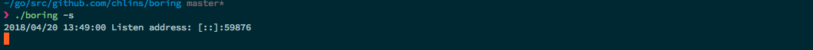
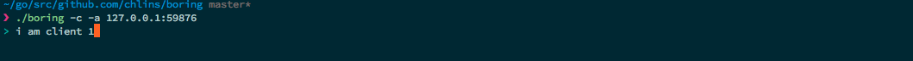
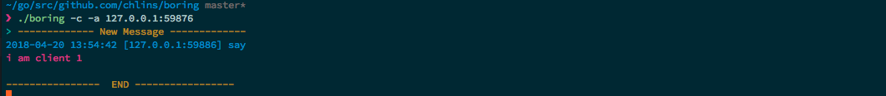

## Boring

This repo is just a boring project aim to chat based on tcp, nothing special, just for fun -..-)

#### Usgae:

* Server: `./boring -s`
* Client: `./boring -c -a <server_ip>:<port>`

#### Screenshots:

Start server: 

Start client 1 and client 2, write something in client 1:

Now you can see client 2:

You are welcome to change the project if you are boring `)O--O(` (just do any magic thing on it).